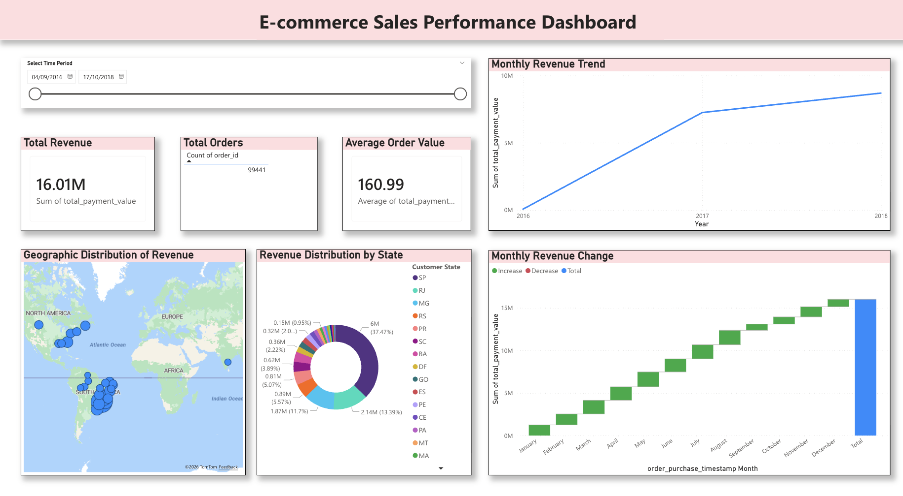
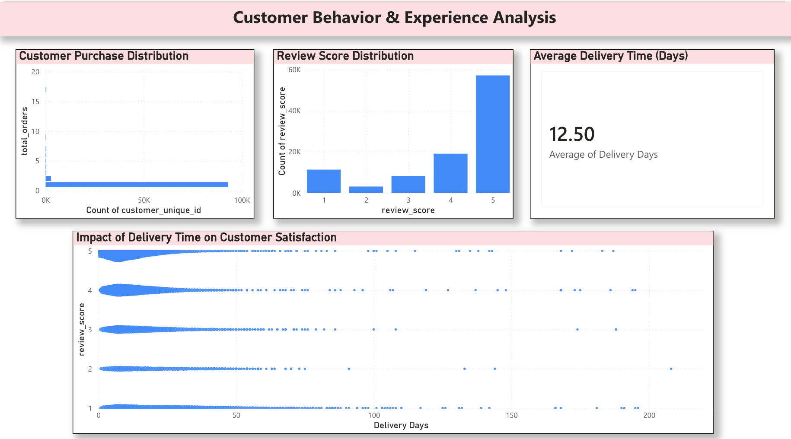
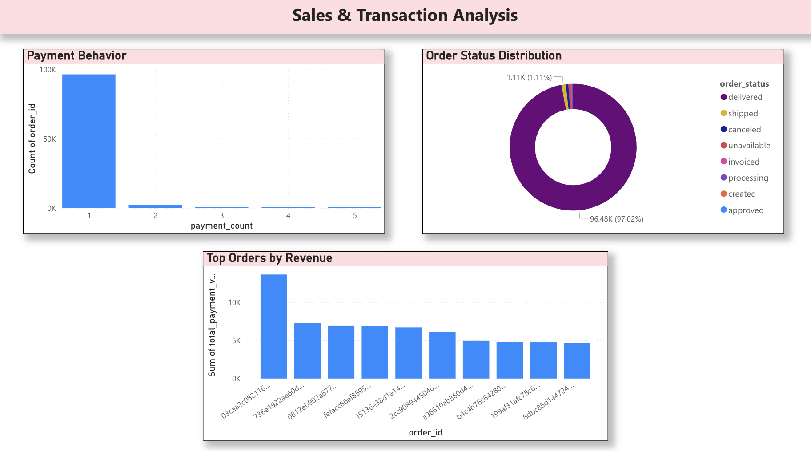

# E-commerce Sales Performance Analysis
*(La version française suit)*

## Project Overview

This project analyzes the sales performance of an e-commerce platform using SQL and Power BI.
The goal is to uncover key business insights related to revenue, customer behavior, and operational performance.

## Objectives

The main objectives of this project are:

* Analyze the overall sales performance of an e-commerce platform
* Identify key revenue trends and seasonal patterns
* Understand customer behavior and purchasing habits
* Evaluate customer satisfaction and delivery performance
* Detect potential churn and retention issues
* Provide actionable business recommendations based on data insights

## Tools Used

* PostgreSQL (data extraction and transformation)
* SQL (data cleaning and analysis)
* Power BI (data visualization)

## Key Metrics

* Total Revenue
* Total Orders
* Average Order Value (AOV)
* Customer Retention
* Delivery Time
* Customer Satisfaction (Review Score)

## Key Insights

* Most customers make only one purchase, indicating low retention.
* Revenue shows an overall upward trend over time.
* Customer satisfaction is generally high, with most reviews rated 4 or 5.
* Longer delivery times tend to be associated with lower customer satisfaction.
* A small number of orders contribute disproportionately to total revenue.

## Business Recommendations

* Implement customer retention strategies (loyalty programs, email marketing).
* Optimize delivery operations to reduce delays.
* Focus on high-value customers and transactions.
* Monitor low review scores to identify operational issues.

## Dashboard Structure

The dashboard is divided into three main sections:

1. Executive Overview - Key KPIs and revenue trends
2. Customer Behavior & Experience - Churn, satisfaction, delivery analysis
3. Sales & Transaction Analysis - Payment behavior and operational performance

## 📊 Dashboard Preview

### Executive Overview

### Customer Behavior & Experience Analysis

### Sales & Transaction Analysis

## Interactive Dashboard

The full interactive dashboard is available in the `.pbix` file included in this repository.
To explore the dashboard, download and open the file using Power BI Desktop.

## Project Files

* SQL scripts
* Power BI dashboard
* Processed datasets (CSV)

## Sample Data

Cleaned sample datasets have been included in this project for demonstration purposes.
The full datasets can be regenerated using the SQL scripts provided.

---

# Analyse de la performance des ventes e-commerce

## Présentation du projet

Ce projet analyse la performance des ventes d’une plateforme e-commerce à l’aide de SQL et Power BI.
L’objectif est d’identifier des insights clés liés au chiffre d’affaires, au comportement des clients et à la performance opérationnelle.

## Objectifs

Les principaux objectifs de ce projet sont :

* Analyser la performance globale des ventes d’une plateforme e-commerce
* Identifier les tendances de revenu et les effets de saisonnalité
* Comprendre le comportement et les habitudes d’achat des clients
* Évaluer la satisfaction client et la performance des livraisons
* Détecter les problèmes de churn et de rétention
* Proposer des recommandations business basées sur les données

## Outils utilisés

* PostgreSQL (extraction et transformation des données)
* SQL (nettoyage et analyse des données)
* Power BI (visualisation des données)

## Indicateurs clés

* Chiffre d’affaires total
* Nombre total de commandes
* Panier moyen (AOV)
* Rétention client
* Temps de livraison
* Satisfaction client (notes)

## Insights principaux

* La majorité des clients n’effectuent qu’un seul achat, indiquant une faible rétention.
* Le chiffre d’affaires montre une tendance globale à la hausse.
* La satisfaction client est globalement élevée (notes 4 et 5 dominantes).
* Des délais de livraison plus longs sont associés à une satisfaction plus faible.
* Une petite partie des commandes génère une part importante du revenu.

## Recommandations business

* Mettre en place des stratégies de fidélisation (programmes de fidélité, email marketing).
* Optimiser les délais de livraison.
* Se concentrer sur les clients à forte valeur.
* Surveiller les mauvaises notes pour identifier les problèmes opérationnels.

## Structure du dashboard

Le dashboard est organisé en trois sections :

1. Vue d’ensemble - KPIs et tendances
2. Comportement client - churn, satisfaction, livraison
3. Analyse des transactions - paiements et performance

## Aperçu du dashboard

### Vue d’ensemble (Executive Overview)

### Comportement et expérience client

### Analyse des ventes et des transactions

## Dashboard interactif

Le dashboard interactif complet est disponible dans le fichier `.pbix` inclus dans ce dépôt.
Pour l’explorer, téléchargez et ouvrez le fichier avec Power BI Desktop.

## Fichiers du projet

* Scripts SQL
* Dashboard Power BI
* Données transformées (CSV)

## Données d’exemple

Des échantillons de données nettoyées ont été ajoutés à ce projet à des fins de démonstration.
Les données complètes peuvent être régénérées à l’aide des scripts SQL fournis.
